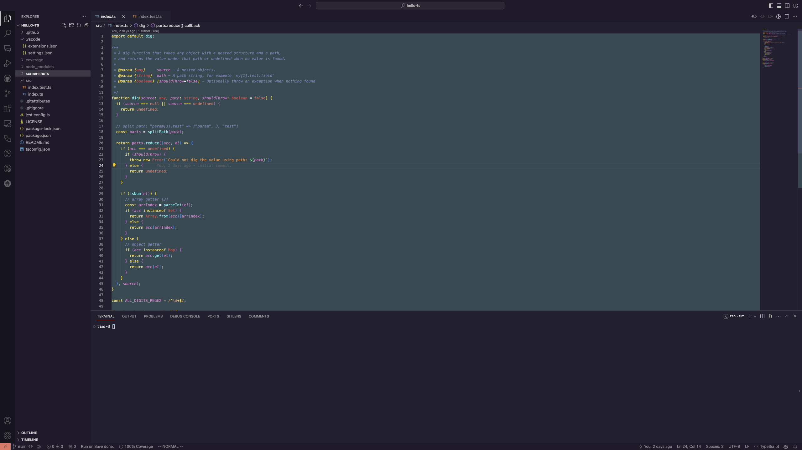

## hello-ts

hello-ts is a simple example repo to show how you can get started with test driven development in TypeScript.

Go has in-line running tests, debugging, and code highlighting baked into their official vscode extension but it turns out most other languages don't have code hightlighting.

I'm not a fan of JS/TS but had to muck with it recently and desperately wanted the same features that come standard with the Go vs-code extention and figured out how to 95% of the save functionality through this goofy but still useful setup.
 


All of the example code we're testing can be found in [src](./src) and comes from this article by @janis_t on twitter [article](https://www.typescriptbites.io/articles/build-test-and-publish-typescript-npm-package-2022) by [@janis_t on twitter](https://twitter.com/janis_t).


## install

This assumes you already have npm (or equivalent) and VScode installed

```git clone https://github.com/TimothyStiles/hello-ts && cd hello-ts && npm install && code .```

Then:

1. Install the recommended vs-code extensions through the dialogue that should pop up when you first open the project.
2. Close out the window
3. Reopen the project with vs-code and extensions installed.
4. Open `src/index.js`.
5. Hit `command + s`

 Now `src/index.js` should have the code gutters like in the above screenshot.
